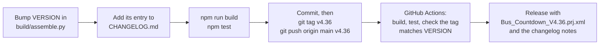

# Contributing

How the project is built, tested and released, and what to know before changing it. The [README](README.md) covers using it, and [docs/how-it-works.md](docs/how-it-works.md) the rules it follows.

## Building

Everything needed to rebuild the project is in this repository: edit a script in `scripts/` or a task in `build/assemble.py`, then

```
npm run build
npm test
```

`npm run build` writes `Bus_Countdown.prj.xml` (Python 3, no other packages needed); `npm test` lints the scripts and then checks everything, including that every script in the project matches `scripts/`. (Run `npm install` once first, for ESLint.)

A script can include a shared piece with a line that is only `/* @include NAME */`; the build (and the tests) replace it with `scripts/shared/NAME.js`, indented to match. So a helper used by many scripts, like `debugLog`, exists once, and a test makes sure no script keeps its own copy. Every script reads globals with `get()` and task locals with `loc()` (both trimmed, and `''` when unset), and measures distances with `metres()`.

`npm run lint` checks the scripts with ESLint (`eslint.config.js`) as Tasker runs them: with their shared pieces filled in, and with Tasker's `global()`, `setGlobal()` and the task's local variables declared, so a misspelt variable is reported. Single quotes, semicolons, `===`, one variable per `var` (Tasker only passes back a script's results declared as `var name`, so one declared after a comma is silently lost), and no unused or shadowed local variables.

### Releasing

Each release is a version tag. Pushing it runs `.github/workflows/release.yml`, which builds and tests the project and publishes a GitHub release with the project file and that version's changelog notes. (`.github/workflows/test.yml` runs the tests on every push.)



`tests/changelog.test.js` fails until the version the build makes has its changelog entry, so the notes can't be forgotten.

## Tests

The `tests` folder runs the project's own scripts (from `scripts/`) the way Tasker does: each JavaScriptlet gets `global()` and `setGlobal()` for global variables, its task's locals as plain variables, and a fixed clock, and every top-level `var` it declares comes back as an output. No phone or Tasker needed, only Node.js 18 or later:

```
npm test
```

What's covered (194 tests, after the linter):

- **The project file matches the scripts:** every JavaScriptlet in `Bus_Countdown.prj.xml` is a file in `scripts/` (with its shared pieces filled in), every file and shared piece is used, no script keeps its own copy of a shared helper, every step has an explanation, and every Perform Task points at a task that exists.
- **Replayed trips** through the state machine: walking past a stop, waiting then catching the bus, walking away with no speed readings, a saved stop coming up on a bus, a jumpy fix while waiting, passing through a circle, swiping away, and a big arrival circle not restarting as you leave.
- **Wi-Fi rules:** home and work, getting home during a countdown, leaving work (and home, if set), and remembering where you came from.
- **How the tasks run together** (`tests/tasks.test.js`, read from the project file): every task's collision setting matches a table with the reason for it; Bus Loop, which waits between refreshes, is always started below everything else, and Bus Settings, which waits while its screen is open, just above it (a waiting task still holds back lower-priority ones, so Settings has to be above the loop to open during a countdown); whatever Bus Loop starts runs ahead of the loop; every Perform Task with steps after it is listed with why that's safe; and only Bus Settings starts itself (it replaces itself).
- **No flashing** (`tests/island.test.js`, including that the room for a second time stays small): times changing, second times coming and going, a route switching to the timetable, and a route dropping out of the predictions or coming back never redraw the pill, and its width is the same whichever of your routes are showing; switching to a stop with a different number of your routes does redraw it; redraws take turns between the two scene names; in the project, Bus Refresh shows the new pill before removing the old one, and everywhere the pill is cleared, both names are.
- **The buzz** (`tests/buzz.test.js`): the same bus buzzes on its first two refreshes under 5 minutes and then not again, the next bus gets its own, one bus at a time (a second route waits until the first bus has gone, and the sooner bus is the one that buzzes), and with the screen off times are fetched only while a bus is within 8 minutes.
- **The trip recorder** (`tests/recorder.test.js`): nothing written when off; each day starts with the setup; positions with their decisions, TfL replies with vehicles and timings, and buzzes each become a line; a weekday's file starts afresh on a new day; and a recorded day replays with no differences.
- **Choosing the stop:** saved stops only, the one you arrived at first, the reason getting through without `%par1`, heading to a stop beyond 300 m, and nothing saved nearby.
- **Bus Loop timing:** the countdown limit, the one-minute heads-up and carrying on after leaving the office, longer waits when the bus is far off, the safety net, and asking for positions again.
- **The changelog and the mockup** (`tests/changelog.test.js`, `tests/mockup.test.js`): the newest changelog entry is the version the build makes, every release has a date, newest first, under Keep a Changelog's headings; the mockup draws the island with the project's own page and has no two timeline entries showing the same island.
- **Smaller pieces:** stop letters, refresh spacing, how recent a position must be, swiping, and reading route orders from TfL.
- **Version 4.11** (`tests/v4.11.test.js`, written first as todo tests): Wi-Fi hysteresis, backing off with no signal, next two buses, and the swipe rule (route changes, 90 dp to dismiss, a fast 60 dp fling).
- **Tuesday 6 October, replayed** (`tests/tuesday.test.js`): excerpts of the first recorded day (`tests/fixtures`; the timings and TfL replies are real, but the stop names, routes, number plates, home and work are stand-ins, and every position is moved the same distance west), played through today's rules: no pop-up on the 517 to work or the 566 home; the 517 TfL dropped for 2½ minutes kept on the island and buzzing at 4½ minutes, not 1.9; still shown on the way to Wexley, where you change, without buzzing for the bus you're on; one buzz from two refreshes 6 seconds apart; and leaving Wexley on the 566 in traffic ending as "on the bus".
- **Which bus you're on** (`tests/tuesday.test.js` and `tests/v4.28.test.js`): Tuesday's three rides each matched to the right bus (WH63YOX to work on the second refresh, LA28LPG to Wexley with the 566 as the connection, LE15BXA home known at once as the bus you got on at Wexley, not the 517 you came in on); and on made-up rides, one refresh not being enough, rivals too close to call, the connection buzzing but never your bus, nothing kept while you're waiting, and buses that drop off the list remembered as gone.
- **Version 4.36** (`tests/v4.36.test.js`): Wednesday evening's brisk walk away from the stop, with one jumpy fix and one high reading from Android, ending as "turned away", not "on a bus"; the jumpy fix held just under bus speed; and a bus passing the stop, or pulling away from the one you waited at, still seen as soon as before. Tuesday's and Wednesday's recordings replay with the same decisions as 4.35.
- **Version 4.37** (`tests/v4.36.test.js`, with `tests/fixtures/wed-7-oct-evening.jsonl`): the recording of that walk, replayed: each fix played as Android gave it (the phone's 247 m, not a second average), the countdown ending as "turned away" at the same moment, and never "on a bus" where 4.33 had you on one for a minute and a half.
- **Version 4.38** (`tests/v4.38.test.js`): Wednesday's train standing at Wexley, with rough fixes, no longer showing the bus stop there, while Tuesday's real bus approach still does; a failed first write of the day leaving the day unstarted so the next line begins the file with the setup; Bus Status reading today's file (lines, last write, or not found and the error); and "Last got on" saying when you're off that bus.
- **Version 4.39** (`tests/v4.39.test.js`, with `tests/fixtures/thu-8-oct-morning.jsonl`): Thursday morning replayed: the tram held short of Kiln Street keeping its countdown (standing still doesn't count as walking off, and walking off takes 2 minutes); getting on the 517 you caught, not the 566 that left a minute before; and still on the bus after it waited at Wexley, with the 517 still yours (the fixture runs on to 09:29, arriving at work).
- **Version 4.40** (`tests/v4.40.test.js`, with `tests/fixtures/wed-7-oct-morning.jsonl`): boarding proved by distance: Tuesday's 517 at Corvel Lodge (the countdown ended without Bus Watch) and Wednesday's change from the tram to the 566 at Kiln Street both found as the bus you got on, while Thursday's 517 held at Wexley stays the bus you were on; and on the test road, a timed-out countdown then 150 m along the route in 40 s, but not a walk on along the route, a fast trip on another road, or a stop you never got to; and Thursday's walk in past the stop by work 6 minutes after getting off, with no countdown (the stop starts as normal again after 15 minutes).
- **Version 4.41** (`tests/v4.41.test.js`): the stop's other routes kept apart from yours for the stop board to come (soonest route first, three times each, up to 8 routes, none when TfL lists only yours), recorded with each TfL reply only when there are some, and handed back to Bus Refresh by a replay.
- **Version 4.34** (`tests/v4.34.test.js`): the Kiln Street tram (your arrival matching the bus you're about to catch leaves it on the island, not greyed, and nothing buzzes) against the same ride having been seen getting on; the bus you got on kept through a crawl in traffic but forgotten once the trip's really over; Tuesday's 517 into Wexley, "probably" yours until 4.40 saw you get on at Corvel Lodge; a boarding helped by a "probably" bus saved as not sure; the bus you got on going once you've been off bus speed for 5 minutes; no second fetch within 20 s from Bus Loop or the screen coming on (but always for a new stop, a preview or a run by hand), and the project wiring for it (the caller copied first, the If's condition, and its End If before the island steps); and the travel mode on trial: still while indoors with the position wandering, walking, riding through red lights, a gap starting it again, Tuesday's 517 ride read as riding, the recording carrying it, and nothing in Bus Watch reading it.
- **Version 4.32** (`tests/v4.32.test.js`, and the wiring checks in `tests/tasks.test.js`): the code review's fixes, each with the case that showed it: times still fetched with the screen off once the next bus is within 8 minutes (it used to keep the minutes from the last fetch), your bus forgotten when a countdown ends mid-ride, the next bus on your own route never taking the connection's buzz, getting off early and walking no longer counting as riding, staying on your bus through a stop, a bus found after a walk-away picked by when you left, a start by hand clearing a swipe snooze, the bus you got on forgotten when you next wait on foot, and the "staying put" skip never applying during a countdown or by hand. The wiring checks read the project file: every Bus End caller passes its reason, Bus End copies it before its script, and Bus Watch's skip comes before the first location step.
- **Version 4.27** (`tests/v4.27.test.js`): the same fixes on the test road, plus the swipe snooze (holding when swiped on the approach, lifting once you've been and gone, and a check running at the same moment not undoing it), poor fixes not faking a bus, staying put far away, TfL unreachable, each stop counting its own buzzes, and the recorder's end reasons, Wi-Fi changes and worked-out speed.
- **Version 4.12** (`tests/v4.12.test.js`): the code review's fixes, each with the case that showed the problem: a southbound bus never picking a northbound stop behind you, waiting still not tripping the safety net, arrival distances capped at 200 m, the direction table noticing any change to your stops, and times fading normally while refreshes back off.

When something goes wrong on the phone, the Debugging report's positions can be turned into a new trip in `tests/trips.test.js`, so the fix is checked and stays fixed.

## Repository layout

| Path | Contents |
|---|---|
| `Bus_Countdown.prj.xml` | The Tasker project, built from the newest code. Releases attach the same file with its version in the name. |
| `CHANGELOG.md`, `LICENSE` | What changed in each version, and the MIT licence. |
| `README.md`, `CONTRIBUTING.md`, `docs/*.md` | Using it; building and testing it (this file); and how it works, its settings, tasks and profiles, the trip recorder and the roadmap. |
| `.github/workflows/` | Tests on every push, and a release for every version tag. |
| `scripts/` | The JavaScriptlet code from the project, one file per action, for reading and comparing changes. Editing these files does not change the project. |
| `docs/pill.png`, `docs/chip.png` | The pill and the status bar chip, drawn from the project's own page. |
| `build/` | The build: `assemble.py` (every task and profile, step by step), `helpers.py`, `labels.py` (each step's explanation) and `templates.prj.xml` (Tasker's own XML for each kind of action). `npm run build` turns these and `scripts/` into `Bus_Countdown.prj.xml`. |
| `tests/`, `package.json` | Tests for the scripts: replayed trips and the rules around them (see Tests). `tests/fixtures` holds excerpts of a recorded day, with home and work replaced by stand-ins. |
| `docs/mockup.html` | The island mockup: **Now** draws the island with the project's own `island_show.js` (built from `docs/mockup.src.html` by `build/mockup.py`), **Timeline** shows each version that changed the island, with a sentence on each, and the early placement and settings ideas. Open it in a browser. |

### Scripts

| Script | Task |
|---|---|
| `menu.js` | Bus: menu items |
| `settings_first.js`, `settings_open.js`, `settings_save.js`, `settings_opposite.js`, `settings_opposite_apply.js` | Bus Settings: first-run check, builds the screen, saves what changed, offers the stop across the road and saves the ones you tick |
| `settings_button.js` | Bus Settings Button |
| `camera_err.js`, `find_camera.js` | Bus Find Camera |
| `settings.js`, `start.js` | Bus Start: settings, and which saved stops to show |
| `cache_check.js`, `cache_route.js`, `cache_merge.js`, `cache_seq.js`, `cache_commit.js` | Bus Start and Bus Settings: daily stop list |
| `loc_age.js` | Bus Start and Bus Watch: rejects old locations |
| `loop.js`, `loop_tick.js` | Bus Loop: when it ends, and how long to wait between refreshes |
| `tt_check.js`, `tt_route.js`, `tt_store.js` | Bus Refresh: timetables |
| `refresh.js`, `island_show.js`, `island_swap.js` | Bus Refresh: departures (two per route), the pill, and which of its two scene names to show it under |
| `shared/` | Pieces several scripts share, kept once and filled in by the build: `record.js` (the trip recorder), `get.js` (read a global), `loc.js` (read a task local), `metres.js` (distance and bearing between two points), `wifiName.js` (the Wi-Fi network from Android's answer), `sides.js` (which side of the road heads home or to work), `routesHere.js` (how many of your routes the current stop has, which the pill is sized for), `debugLog.js` (the Debugging log), `swipe.js` (the pill's swipe rule, also tested on its own) and `matchBus.js` (which listed bus is the one you're riding) |
| `fullscreen.js` | Bus Hide When Sideways and Bus Refresh: sideways or upright? |
| `opposite.js` | Bus Island: the next nearby stop |
| `watch_due.js`, `watch.js` | Bus Watch: the Wi-Fi rules, then the trip state machine (which also sets the position rate) |
| `moved.js` | Bus Watch: reads a pushed position |
| `push_params.js` | Bus Wake and Bus Loop: the current position rate, to ask for again |
| `place_record.js` | Bus Watch: remember where home and work are |
| `wifi_save.js` | Bus Wake and Bus Watch: remember which Wi-Fi network you're on, for the other tasks |
| `start_fix.js` | Bus Start: use the position just pushed, instead of fetching one |
| `glance_check.js` | Bus Wake: the heads-up at work (a one-minute countdown, which Bus Loop extends if you've left the office Wi-Fi) |
| `debugging.js` | Bus Status: the Debugging report |
| `end_log.js`, `profiles_done.js` | Bus End and Bus Wake: notes for the debugging log |
| `status.js` | Bus Status |

## Notes for editing

- **Every change to how the island looks is recorded in the mockup.** Add the version and a new look to `VERSIONS` and `LOOK` in `docs/mockup.src.html`, run `npm run build`, and republish `docs/mockup.html` wherever you host it. A version that changes only what happens underneath gets no entry, and the page stays as it is (it names the island's last change, not the project's version). `tests/mockup.test.js` fails if two entries draw the same island.

- A JavaScriptlet only returns a local variable to the task if it is declared on its own `var` line. `var a = 1, b = 2;` returns only `a`.
- Step labels are plain text, "Title · Explanation", because the Run Log prints labels exactly as written (HTML labels look good in the task editor but fill the log with tags).
- `%caller1` isn't visible to scripts. Bus Watch copies it into `%buscaller` first, and marks runs from Bus Wake and Bus Loop as `profile=wake` and `profile=loop`; Bus Refresh copies it into `%busrefby` (4.35).
- The connected Wi-Fi network is read from Android with Java Function (`WifiManager.getConnectionInfo().getSSID()`) in Bus Wake and Bus Watch only (and Bus Settings, for its "Use" button), and saved in `%BusStateWifi` for the other tasks. `%WIFII` isn't used: it stops updating once no profile has a Wi-Fi condition.
- The pill's web page must not contain a percent sign followed by letters, apart from the data placeholder, or Tasker treats it as a variable.
- Scene V2 web views need fixed pixel heights (not `100vh`), `darkMode: ForceLight`, and a rounded clip on the parent box to draw a transparent, rounded pill. Any part of the overlay window not covered by the page shows as black. The pill also needs a fixed width equal to its window: as a plain flex box it stretched to the page's width, which can be wider than the window, cutting off its rounded right end.
- Android's web view ignores `navigator.vibrate`, so the pill asks Tasker to vibrate instead.
- Showing another Scene V2 while the settings screen is open did nothing and left the screen unable to report that it had closed, so Preview closes the settings first.
- The settings screen is a Scene V2 layout built as JSON by `settings_open.js`. Show Scene V2 runs in `FullscreenWithResult` mode, so the task waits and receives the screen's variables when it closes. Every choice is a pair of buttons ("✓ 45 s" and "45 s") swapped by `showWhen`, and each tap also runs Bus Settings Button, which saves it (or records it, for routes and distances) straight away: values set by a button that then hides itself didn't reliably come back to the task. Screen variable names spell numbers with letters (0-9 become a-j), keeping them clear of Tasker's array naming.
- Rows of option buttons are FlowRows, which wrap onto a new line; in a plain Row the last button gets squeezed until its label stacks one letter per line. Unselected options use plain hex colours, because the theme name `surfaceVariant` wasn't applied to buttons.
- The segmented-button row reports and sets its selection counting from 1, not 0. (The settings screen no longer uses it.)
- Tasker's Java Function action needs `{Object}` as the return type for classes it doesn't recognise, such as `DisplayCutout`.
- A Java Function method that returns nothing is written with `{}` as its return type (for example `startActivity {} (android.content.Intent)`); `{void}` fails with "failed to init return class void".
- Pushed positions: `LocationManager.requestLocationUpdates("fused", 10000, 20, PendingIntent)`, with the PendingIntent a mutable broadcast to Tasker's package caught by an Intent Received profile. The position Android attaches arrives in Tasker as `file:///`, so Bus Watch reads `getLastKnownLocation("fused")` instead, which is the fix just pushed. Each request reuses an identical PendingIntent, so asking again just replaces the previous rate; the rate is chosen by the trip state in `watch.js` and re-requested by Bus Wake (Android forgets it after a restart). (Android's proximity alert, `addProximityAlert`, registered but never fired in testing; Google Play Services geofencing isn't reachable from Tasker.) Bus Watch also reads the fix's own speed (`hasSpeed`, `getSpeed`): over 0.8 m/s inside a stop's circle means passing by, so it asks for a position every 15 s with no minimum distance (`requestLocationUpdates("fused", 15000, 0, …)`) until you slow down or leave the circle. For "heading to a stop" on foot it also reads `getBearing`, compares it with the direction to each saved stop (within 45°), and divides the distance by the speed to see whether you're due there within `%BusApproachMin` minutes.
- Imported event profiles (Bus Moved in particular) don't listen until they're switched off and on. Bus Wake does this with Profile Status (action 159) once after every import (each build has its own id, so a re-import of the same version still triggers it), recorded in `%BusStateVersion`.
- The permission checks and settings-page buttons use Tasker's package name, `net.dinglisch.android.taskerm`.
