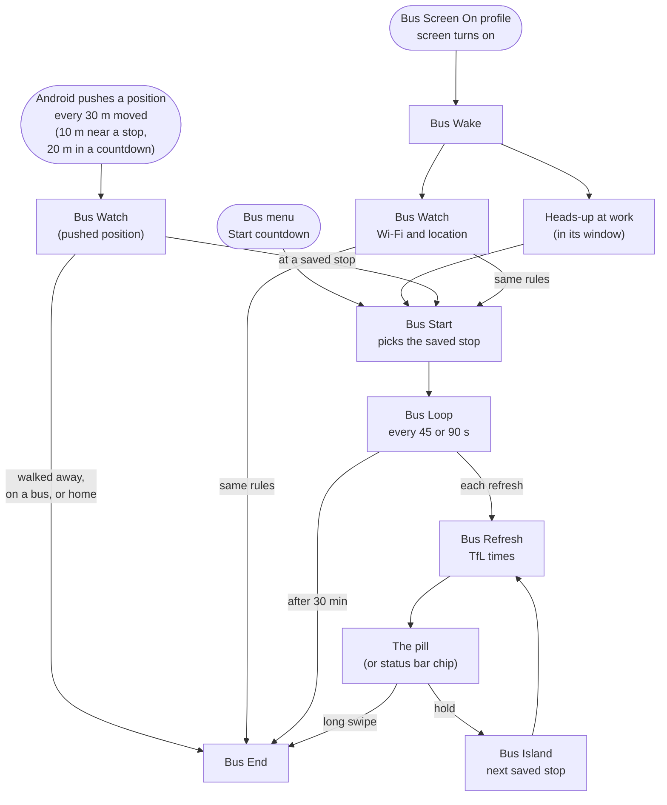
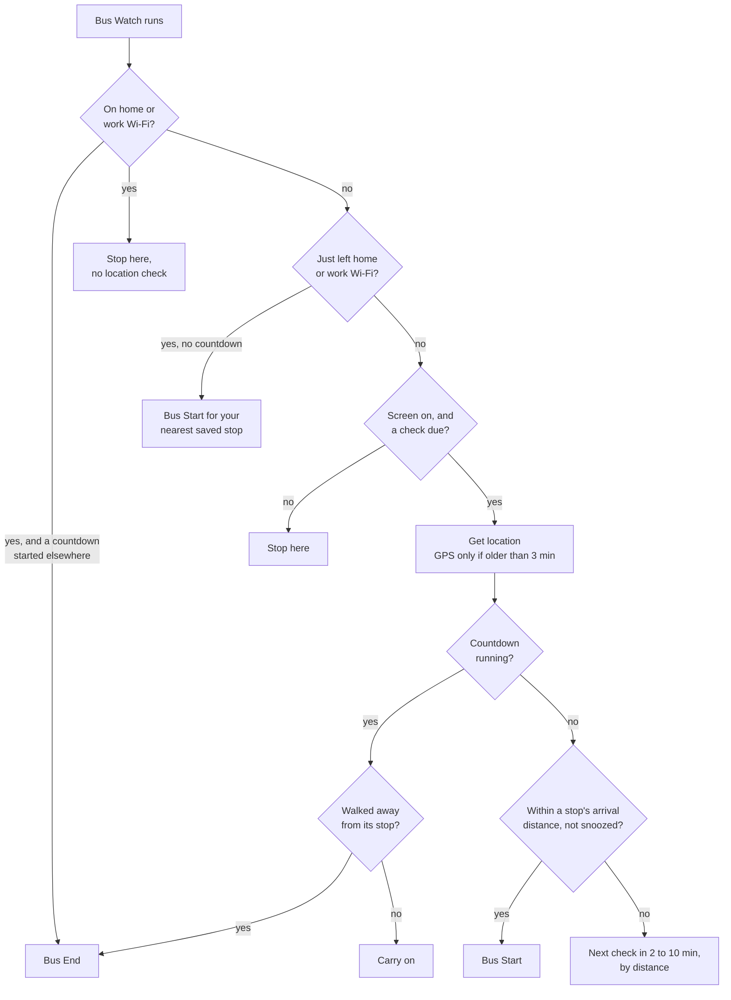
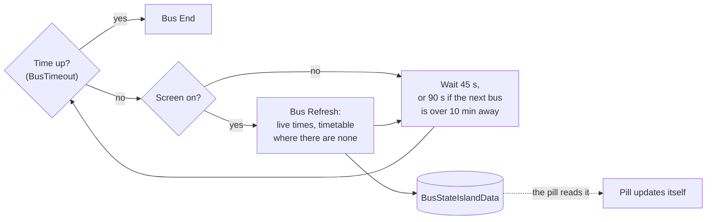
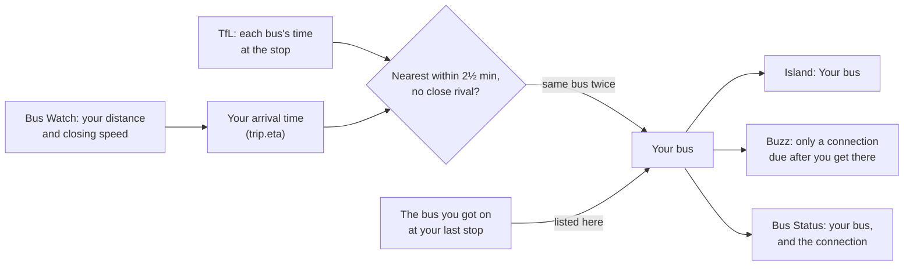

# Bus Countdown

Version 4.28

A Tasker project for Android that shows live London bus arrivals in a small pill around the front camera, in the style of a "dynamic island". It starts when you arrive at a saved bus stop and ends when you leave.

Data comes from the [TfL Unified API](https://api-portal.tfl.gov.uk/). Built and tested on a Pixel 8 Pro.


## Features

- Live arrivals for your routes at the nearest stop, in a pill around the camera hole, or as a small chip in the status bar.
- Several routes at a stop take turns, and you can swipe between them.
- Falls back to the published timetable when TfL has no live prediction for a route (it only predicts about 30 minutes ahead) or can't be reached.
- Starts by itself at a saved stop and ends when you walk away.
- Leaving work: once your phone drops off the office Wi-Fi and you start moving, it shows the next buses from your nearest saved stop, so you can see them on the way. (Home, both or neither, in Settings.)
- Heading to a stop: walking towards a saved stop, or on a bus coming up to one, shows its next buses a few minutes before you get there, so you can decide in time (for example, whether to get off at the stop before).
- The right side of the road: where a stop has a partner across the road, the side heading your way comes first. On a weekday morning coming from home, that's the side towards work; coming from work, the side towards home. Weekends and other trips show the nearer side, as before. The other side is always a long press away.
- At work, in an evening window, turning your screen on shows your stop's next buses for a minute.
- Hides while the phone is sideways, for full-screen videos and games.
- A settings screen for everything, including picking your routes at each stop.
- No plugins.

## Requirements

- Android 10 or later.
- [Tasker](https://tasker.joaoapps.com/). The project was exported from Tasker 6.7.6.
- A free TfL API key from <https://api-portal.tfl.gov.uk/>.
- Tasker permissions (the settings screen checks them and opens the right Android page for any that are missing):
  - Location: Allow all the time, with Use precise location on.
  - Display over other apps.
  - Tasker's accessibility service on (needed to draw over the status bar).
  - Battery: Unrestricted.

## Installation

1. Download `Bus_Countdown.prj.xml`.
2. In Tasker, long-press the project bar at the bottom, choose Import Project, and pick the file.
3. Run the **Bus Settings** task.

The first time, Bus Settings measures the camera cutout before opening. Enter your TfL key under Setup, set your home and work Wi-Fi, then under Stops and routes tap the routes you want at the stops you use. Stops within 400 m of you are listed with their routes. Tap Done. For each stop you've added, it then asks whether to save the stop across the road too, showing its name, letter and direction.

For day-to-day use, add the **Bus** task as a home screen shortcut or Quick Settings tile. It opens a menu: Start countdown (or End countdown while one is running), Settings, Status and Debugging.

After importing a new version, there's nothing to switch on by hand: the first time you turn the screen on, open the Bus menu or Settings, Bus Wake switches the profiles off and on, which imported profiles need before they start listening.

## Using it

The pill appears by itself when you reach a saved stop and slow down or stop there, even with the phone in your pocket (it's showing when you look). Walking straight past a saved stop doesn't start it: Android's speed reading shows you're still walking. It also appears:

- when you're heading towards a saved stop and due there within 3 minutes, on foot or by bus (Settings: Heading to a stop, Minutes ahead);
- after you leave work Wi-Fi, for your nearest saved stop (home too, or neither, if you choose in Settings);
- at work, between 17:00 and 18:00 by default, for a minute each time you turn your screen on (it carries on as a normal countdown if you've left the Wi-Fi by then);
- whenever you choose Start countdown from the Bus menu, for your nearest saved stop.

| Gesture | Action |
|---|---|
| Short swipe left or right (24 dp or more, short of a dismiss) | Next or previous route |
| Long swipe left or right: 90 dp, or a quick 60 dp fling | Dismiss (the pill follows your finger and fades as you go) |
| Long press | Switch to the next nearby stop, usually the one across the road |

The first time the pill appears, a message explains the gestures. The phone gives a short tick when a swipe is long enough to dismiss, and vibrates when the pill is dismissed or a long press switches stop.

A countdown ends when:

- you dismiss it,
- `%BusTimeout` minutes have passed (30 by default),
- your phone is on your home or work Wi-Fi at a check, unless the countdown started on that same network (so one you start by hand at home or in the office carries on). With the screen off nothing checks, so it ends the moment you turn the screen on, or
- you walk away from the stop: more than three times its arrival distance (150 to 250 m, and always at least 100 m beyond the arrival distance itself), once you've been at it; or three positions in a row each further away, once you're past the arrival distance plus 50 m (at least 120 m). A countdown that started before you reached the stop ends once you're 200 m further away than the closest you got.
- you're on the bus: faster than 15 km/h heading away from the stop, on two positions in a row, or on one once you're past the end distance (Android's own speed reading when it has one, otherwise worked out from positions at least 8 seconds apart).

A countdown that started before you reached the stop ends once you're 200 m further away than the closest you got.

During a countdown, Android pushes your position to Tasker each time you've moved 20 m, even with the screen off, and each one is checked against these rules. In testing, walking away was spotted within a minute, with the phone in a pocket. Bus Watch also checks when the screen comes on. If no position arrives for 2 minutes (for example, Bus Moved isn't listening after an import), Bus Loop checks your location itself.

After you dismiss a countdown, it won't start again by itself until you've moved away from all your saved stops, or for 30 minutes, whichever comes first. Start countdown from the Bus menu ignores this.

## Reading the pill


- The ring on the left is the stop's letter, as on TfL's stop flags (one or two letters, such as B or BK). Stops without a letter, where TfL gives something like "opp" or an arrow instead, show no ring.
- When a bus is less than 5 minutes away, the phone gives three 200 ms buzzes (each one noted in the Debugging log), on two refreshes in a row (about 45 seconds apart), and then stays quiet for that bus. One bus at a time: only the soonest bus at the stop, whatever its route, can buzz, and the next only gets its turn once that one has gone, so two routes arriving together give one set of buzzes. It works with the screen off: while a bus is within 8 minutes, times are still fetched with the screen off.
- Each route shows its next bus and the one after, quieter: "5 · 12 min". With only one bus coming, just the one time. (TfL sometimes lists the same bus twice; a time within a minute of the first counts as the same bus.)
- Minutes in white are live. `~12 min` in grey is from the timetable, used when TfL has no live prediction.
- `Due` means under a minute. `Cancelled` replaces the minutes for a cancelled service.
- Minutes turn faint when the times are more than two refreshes old, for example with no signal.
- Dots, at the right-hand end, show how many routes there are and which one is showing. The minutes always start in the same place, just past the camera, so they don't shift as routes take turns.
- Shown as a status bar chip, the pill has just the stop letter, the route and the minutes (separated by a thin line), to the right of the clock.
- An optional border (off by default) drains until the next route or refresh.

## The settings screen

Bus Settings opens a native Tasker screen (Scene V2), with the most used sections first:

- **Stops and routes.** Your stops, then other stops within 400 m. Tap the routes you want at each stop; a stop with a chosen route moves up under Your stops. Stops on both sides of a road share one entry showing one side at a time, with ⇄ to switch; each side says which way it goes. Stops you use get an arrival distance: 50, 100 or 200 m, or Custom (up to 200 m) (tap it, type the distance, then Use custom; tapping a preset hides the box again). Custom is always there, and filled only while a custom distance is in use, for example ✓ Custom 70 m. To take a saved stop off your list, tap Remove stop (Undo brings it back); it's removed when the screen closes, and isn't added back automatically as a stop across the road. Its routes stay if you use them at another stop.
- **Countdown.** How often times update, when a countdown stops by itself, how long each route shows, how far Start countdown looks for stops, and whether (and how far ahead) to show a stop you're heading towards.
- **Home and work Wi-Fi.** The two networks (with buttons to use the one you're on, or clear work), which of them shows your nearest stop's next buses when you leave it (work by default), and the heads-up window at work.
- **Island.** Island or status bar, the optional border, how much of the destination to show (3, 6 or 10 letters), the gap for the camera, the distance from the top, and where the status bar chip starts. Preview closes the settings, shows the real island or chip for 6 seconds, then reopens them. Reset measures the camera again.
- **Setup.** The TfL key, and permissions (one line when they're all on).

Choices save as soon as you tap them. Text, sliders, routes and distances save when the screen closes, with Done or the back gesture. A message lists what changed.

## Tasks

| Task | Purpose |
|---|---|
| Bus | Menu: Start countdown (or End countdown while one is running), Settings, Status, Debugging. |
| Bus Settings | The settings screen. On first run it measures the camera before opening. After saving, it refreshes the route stop lists if your stops or routes changed, and offers the stop across the road for each stop you've added (a list with each stop's name, letter and direction: tick the ones to save). |
| Bus Settings Button | Run by the settings screen's buttons: saves choices as they're tapped, records route taps, stop distances and removed stops (in `BusTempTicks`, `BusTempDists` and `BusTempRemoved`) for when the screen closes, or opens the Android settings page for a missing permission. |
| Bus Find Camera | Reads the camera cutout's position and size from Android and sets the island's camera settings. Also run by Reset, which then moves the open screen's sliders to the new values. |
| Bus Start | Applies settings and starts Bus Loop for your saved stops only (using the position just pushed when a pushed check started it, otherwise fetching one), and asks Android to push a position every 20 m you move (to Bus Moved) for the countdown: up to four within `%BusRadius` that your routes call at, nearest first. When Bus Watch starts it because you've reached a saved stop, that stop is shown first; a long press moves on to the others. When started on leaving home or work, or for the heads-up at work, it looks up to 1 km away. Stops you haven't saved are never shown. |
| Bus Loop | Every `%BusRefresh` seconds (twice that while the next bus is more than 10 minutes away), with the screen on (or off, while a bus is within 8 minutes): runs Bus Refresh. Ends with Bus End after `%BusTimeout` minutes, or carries on while you're still waiting at the stop (2 hours at most). Safety net: if no position has been pushed for 2 minutes (10 if you were standing still, when Android rightly sends nothing), it asks Android for them again at the current rate and has Bus Watch check your location, so a countdown still ends when you leave; it also switches Bus Moved off and on in case it stopped listening. |
| Bus Refresh | Gets live arrivals and, where needed, timetable times. Shows the pill the first time; after that the pill updates itself from `%BusStateIslandData`. Also run by the Bus Hide When Sideways profile: hides the pill while the phone is sideways, and shows it again with fresh times when it's upright. |
| Bus End | Ends the countdown, removes the pill or chip, and sets the pushed positions back to every 30 m. |
| Bus Watch | Every check runs here: a position pushed by Android (the Bus Moved profile), the screen coming on (Bus Wake), Bus Loop's safety net, or you running it by hand (to see what it found and why). Only where the position comes from differs. It applies the Wi-Fi rules, moves the trip on (idle, heading, at stop, on bus, left), starts or ends countdowns, and sets how often Android pushes positions next. |
| Bus Island | Everything the pill's gestures ask of Tasker apart from ending (that's Bus End): the tick when a swipe is far enough to dismiss, and switching to the next nearby stop on a long press. |
| Bus Wake | Once after each import (or when the Bus menu, Bus Settings or Bus Start ask), switches the three profiles off and on so imported ones start listening. Run by the Bus Screen On profile: makes sure positions are being pushed (they stop if the phone restarts) and notes which Wi-Fi network you're on; the heads-up at work if it's due; during a countdown, fresh times; and a Bus Watch check. |
| Bus Status | Shows the current state, the Wi-Fi network you're on, what Bus Watch last decided and why, and the main settings; and, however it's run (Status or Debugging in the Bus menu, or Tasker's run button), copies the full report, with the last 20 decisions, to the clipboard. Debugging (par1 `copy`) just says it's been copied. |

## Profiles

| Profile | Active | Runs |
|---|---|---|
| Bus Screen On | When the screen comes on | Bus Wake |
| Bus Moved | When Android pushes a position (Intent Received, `net.buscountdown.MOVED`) | Bus Watch |
| Bus Hide When Sideways | While Display Orientation is Landscape (runs on entering and leaving) | Bus Refresh |

Losing home or work Wi-Fi only counts as leaving once you're also 50 m from that place, or, with no position, once it has stayed gone for two checks, so a brief drop at your desk is ignored. Bus Watch applies the Wi-Fi rules itself rather than through profile conditions (the profile's only condition besides the time is Display State: On), because Tasker's "not connected to" condition stopped the profile firing at all. It skips the location check on home or work Wi-Fi and while the screen is off, and notices when you connect to or leave either network.

## Settings

Most of these are on the settings screen. All of them can also be set in Tasker's Vars tab. Empty or invalid values are replaced with the default the next time Bus Start runs.

| Variable | Default | Description |
|---|---|---|
| `%TflKey` | (required) | TfL API key |
| `%BusRoutes` | set in Bus Settings | Your routes, comma-separated, e.g. `25,N25`: every route you've chosen at a stop |
| `%BusPlaces` | set in Bus Settings | Saved stops, one per line: `type\|id\|name\|lat\|lon\|radius` |
| `%BusNearRadius` | 50 | Arrival distance, in metres, for a stop without its own |
| `%BusHomeWifi` | set in Bus Settings | No checks on this network; connecting ends a countdown, leaving starts one |
| `%BusWorkWifi` | optional | The same, for work |
| `%BusApproach` | `both` | Show stops you're heading towards: `off`, `walk` (on foot only) or `both` (on foot and by bus) |
| `%BusApproachMin` | 3 | How many minutes ahead: 2, 3 or 5 |
| `%BusHomeAt`, `%BusWorkAt` | recorded | Where home and work are: a running average of positions seen while on their Wi-Fi |
| `%BusRecord` | `off` | Record trips: `on` writes every position, decision, TfL reply and buzz to a file in Download (see Trip recorder) |
| `%BusLeaveShow` | `work` | Which Wi-Fi, when you leave it, shows the next buses from your nearest saved stop: `work`, `home`, `both` or `off`. Otherwise a countdown only starts when you reach a saved stop's arrival distance. |
| `%BusGlanceFrom`, `%BusGlanceTo` | 17:00, 18:00 | Heads-up at work: in this window, on work Wi-Fi, turning the screen on shows your stop's next buses for a minute. `off` turns it off. |
| `%BusRefresh` | 45 | Seconds between refreshes |
| `%BusTimeout` | 30 | Minutes before a countdown ends by itself (unless you're still waiting at the stop: then it carries on, up to 2 hours from the start) |
| `%BusRotate` | 6 | Seconds each route is shown |
| `%BusRadius` | 300 | Metres Bus Start looks for your saved stops |
| `%BusStyle` | `pill` | `pill` (round the camera) or `chip` (in the status bar). Both are drawn by Tasker the same way. |
| `%BusBorder` | `off` | `on` draws a border round the pill that drains until the next route or refresh |
| `%BusDestLetters` | 3 | How many letters of the destination the pill's left side has room for: 3, 6 or 10. The left side is sized to fit the stop letter, the widest route and that many letters. |
| `%BusChipX` | 76 | Where the status bar chip starts, in dp from the left edge |
| `%BusIslandGap` | set by Bus Find Camera | Space left over the camera, in dp |
| `%BusIslandY` | set by Bus Find Camera | Top of the pill in dp, so that it lines up with the camera |
| `%BusCameraX` | set by Bus Find Camera | Camera centre in dp from the left edge. The screen centre is used if not set. |
| `%BusScreenW` | set by Bus Find Camera | Screen width in dp |

### Internal variables

Variables starting with `BusState`, `BusCache` or `BusTemp` are managed by the project. Deleting any of them is safe; they are rebuilt when needed.

- `BusDebugLog`: the last 20 decisions, for Debugging (Bus Status).
- `BusStateTrip`, `BusStateWindow`: the trip's state and the last six positions (see "The trip, step by step").
- `BusStateSnooze`: the stop you last swiped away, and when (kept apart from the trip so a check running at the same moment can't undo it).
- `BusStateSeen`: the buses TfL last listed at the current stop, so one it drops can be kept on its countdown. `BusStateBuzzed` and `BusStateBuzzAt`: which buses have buzzed at which stop, and when the last buzz was.
- `BusStateMatch`, `BusStateBoarded`, `BusStateCameOn`: the bus you're riding (while it's being worked out, and once known), the bus you last got on, and the bus you last came in on (see "Which bus you're on").
- `BusStateLastBusAt`: when you were last moving at bus speed (for stops by home and work). `BusStateFarAt`: where you settled, while positions are slowed down far from your stops. `BusStateEndWhy`: why Bus Watch ended the countdown, for the recorder.
- `BusState…`: current state, such as whether a countdown is running, which stop is shown, the last Wi-Fi network seen and what Bus Watch last decided.
- `BusCache…`: every stop on your routes and their order along each route (refreshed daily, or when your routes change), and today's timetables for recently used stops.
- `BusTemp…`: values passed between steps of one task.

`BusPlacesSkip` lists stops you removed on the settings screen, or said no to when offered as a stop across the road, so you aren't offered them again.

## How it works

### The flow at a glance

Android pushes your position to Tasker as you move (every 30 m; every 10 m when you're close to a saved stop; every 20 m during a countdown), and Bus Watch, run by the Bus Moved profile, applies the rules to each one: arriving at a saved stop, or leaving work Wi-Fi (home too, if you choose), starts a countdown; home or work Wi-Fi, walking away or being on the bus ends it. This works with the screen off. Bus Watch applies the same rules when the screen comes on. Turning the screen on at work in the heads-up window, or Start countdown in the Bus menu, also start one. Once running, Bus Loop keeps the times fresh.



<details>
<summary>More detail: what Bus Watch decides, and what happens on each refresh</summary>

#### What Bus Watch decides

Bus Watch runs these rules for each position Android pushes (via the Bus Moved profile), using the pushed position; and when the screen comes on (from Bus Wake) and when you run it by hand.



- "Walked away" means more than three times the stop's arrival distance (150 to 250 m) once you've been at the stop, or 200 m further than the closest you got if you haven't reached it yet. Moving at bus speed away from the stop also counts: two positions in a row, or one once you're past the end distance.
- Checks from Bus Wake and Bus Loop don't wait for the next scheduled check.
- "Not snoozed": after you swipe a countdown away (`%BusStateSnooze`), nothing starts again by itself until you've been to that stop and left it (150 m past the closest you came, clear of all your stops), or for 30 minutes.
- Stops by home or work (within 400 m of where Bus Watch has learned they are): on a bus towards one, or within 5 minutes of getting off a bus, it doesn't pop up. That's where you get off. Walking up to it to catch a bus, it starts as normal; a stop where you change buses always shows.

#### Each refresh



- Bus Refresh fetches live arrivals from TfL, fills gaps from today's timetable, and writes the result to `%BusStateIslandData`. The pill's page picks up the change itself, so it's only shown once per countdown (again if the number of routes changes).
- With the screen off nothing is fetched; Bus Wake fetches fresh times as soon as the screen comes back on.

</details>

The pill is a web page inside a Tasker Scene V2 overlay. Bus Refresh builds the page and its layout in a JavaScriptlet, and shows it with Show Scene V2. The page handles route changes, the optional border and the gestures itself, and reads new data from `%BusStateIslandData`, which Bus Refresh updates on each refresh. Tasks it starts (Bus End and Bus Island) receive `%busfrom` = `island`, which is how they know to vibrate.

The pill never flashes when it updates, and never changes size during a countdown. It's sized for every one of your routes at the stop (one dot each, whether or not TfL has a time for it right now) and for two ordinary times ("88 · 88 min", the second smaller); a rarer, wider pair (timetable "~" on both) shows just the first time rather than ever being cut off. So times changing, a second time appearing or going, a route switching to the timetable, or a route dropping out of the predictions and coming back never change its size; the page just redraws its text. Only switching to a stop with a different number of your routes, or changing Settings, changes the size, and then the new pill is shown on top before the old one is removed: it takes turns between two scene names (`buspill` and `buspill2`, chosen by `island_swap.js`), so there's never a moment with no pill, even if a refresh is interrupted part-way.

The overlay window is exactly the size of the pill. Its left edge is calculated from the camera's position so that the gap sits over the camera. The left half fits the stop letter, the widest route badge and `%BusDestLetters` letters of the destination, all measured in the phone's own fonts. The right half is sized to fit the longest likely time plus one dot per route, and the pill is shown again if the number of routes changes. The status bar chip is the same page with the destination left out, placed `%BusChipX` dp from the left.

Camera detection uses Tasker's Java Function action to call `Display.getCutout().getBoundingRects()`, with the current window insets as a second source, and `Resources.getDisplayMetrics()` for the screen density.

Bus Start finds stops from each route's own stop list (`/Line/{id}/StopPoints`) rather than a radius search, because the route list returned by the radius search can include routes that don't stop there. The settings screen uses the radius search only to list stops near you and their routes, and "towards" to tell the two sides of a road apart. The stop across the road is found from the route stop lists (the nearest other stop on the same route within 200 m) and offered, not saved automatically.

### The trip, step by step

Bus Watch (for every pushed position, and when the screen comes on) keeps each trip in one of five states, in `%BusStateTrip`:

| State | Island | Moves on when |
|---|---|---|
| Idle | none | you're inside a saved stop's circle and have slowed down, or stayed put for 30 seconds whatever a rough GPS speed reading says (at stop), or heading for one due within a few minutes (heading) |
| Heading | showing | you reach it and slow down (at stop); you go past it, turn away, or pass it on a bus (left / on bus); or you got off well short of it (walking, more than twice the minutes-ahead setting away, on three checks running: left) |
| At stop | showing | you're on a bus heading away, or moving away at over 2.2 m/s for 90 seconds or more, however slowly the bus crawls (on bus); you walk steadily away, or pass the end distance (left: and if the pace then shows it was a bus after all, on bus) |
| On bus | none, unless a saved stop is coming up on the route | you're at walking pace again (left); the stop you boarded at is kept, so a bus held up while still inside its circle doesn't show it again |
| Left | none | after 15 minutes, or once you've come back 100 m from the furthest you went (idle); other stops are free straight away |

Swiping the island away, the 30-minute limit and getting home also move it to Left. Decisions use the last six positions (`%BusStateWindow`): speed is the median of the last three readings (or the last two both being fast; Android gives a speed for only about one position in eight, so mostly it's worked out from the positions, ignoring any fix worse than 50 m), "moving away" is the trend of your distance over the most recent positions, and fixes worse than 25 m are averaged with the previous one. On a bus, the stop coming up is found by projecting your position onto the route's line of stops, rather than by compass direction. Which way each saved stop's side heads is worked out once and kept in `%BusCacheDir`.

### Which bus you're on

When a countdown shows a stop you're riding a bus towards, Bus Watch keeps when you'd get there at the pace you've been closing in on it, and Bus Refresh compares that with each bus TfL lists. The bus whose time agrees (within 2½ minutes, with no other bus nearly as close) on two refreshes in a row is yours. On Tuesday 6 October's three rides each bus's time was within 10 to 30 seconds of when you actually reached the stop.



- **Your bus** replaces the destination on the island, and never buzzes. Until it's known, nothing buzzes while you ride; once it is, only a connection (a bus due after yours gets there) can. Once your bus has reached the stop and dropped off TfL's list, buzzing is as usual.
- **Getting on:** when a countdown ends because you're on a bus, the bus you got on is the one TfL had arriving nearest the moment you left the stop (including one that dropped off the list in the last 5 minutes, but never the bus you came in on). It's kept for 90 minutes (`%BusStateBoarded`), so at your next stop it's known at once, and recorded with how far TfL's time was from when you left.
- Bus Status shows your bus and the connection ("on the 517, at Wexley in about 2 min; then the 566 6 min after you get there"), and the last bus you got on.

### Sideways

The Bus Hide When Sideways profile (Display Orientation: Landscape) runs the task of the same name when the screen turns sideways and again when it turns back. It asks Android which way up the screen is (its configuration says `port` or `land`) and hides the pill, or shows it with fresh times. Bus Refresh asks the same question before showing the pill. The countdown keeps running while the pill is hidden.

Earlier versions used an invisible overlay to watch for the status bar being hidden, which also hid the pill during picture-in-picture video.

### Battery

- Positions are pushed by Android only as you move (every 30 m; every 10 m only when close to a saved stop; 20 m during a countdown): sitting at home or at your desk costs nothing, and nothing checks on a timer.
- Staying put somewhere 300 m or more outside all your stops' circles (a café, a friend's), indoor GPS wanders 30 to 70 m, which would beat the 30 m step, so positions slow to every 100 m, at most once a minute, until you've moved 150 m; the screen coming on doesn't take a new fix there if there was one in the last 2 minutes.
- During a countdown, Bus Loop doesn't fetch times while the screen is off, except while a bus is within 8 minutes (for the buzz); Bus Wake fetches them as soon as the screen is back on. While the next bus is more than 10 minutes away it fetches half as often.
- When TfL can't be reached (no signal), each failure in a row doubles the wait before trying again (90, 180, then at most 300 seconds); the first success goes straight back to normal.
- Every check asks for Android's ordinary location first (Wi-Fi and mobile networks) and only forces GPS on if that position is too old: over a minute during a countdown (so walking away is seen promptly), over 3 minutes otherwise.
- The optional border is updated 4 times a second (several routes) or once a second (one route), with a CSS transition to keep it smooth, and not at all while the screen is off.
- Turning sideways is noticed by a Tasker profile, not by anything running in the background.

### TfL endpoints used

| Endpoint | Used for | Frequency |
|---|---|---|
| `/StopPoint?lat&lon&radius=400` | Stops near you, on the settings screen | Each time Settings opens |
| `/Line/{route}/StopPoints` | All stops on each route | Once a day per route, and when your routes change |
| `/Line/{route}/Route/Sequence/{inbound,outbound}` | The stops in order, both ways, to tell which side of a road heads home or to work | Once a day per route, with the above |
| `/StopPoint/{stop}/Arrivals` | Live arrivals | Every refresh |
| `/Line/{route}/Timetable/{stop}` | Scheduled departures | Once a day per stop and route |

## Known limitations

- While the settings screen is open, the Bus Settings task waits for it to close, and Tasker holds back lower-priority tasks meanwhile (even a task that's only waiting holds back lower ones). So the Bus menu opens Settings at priority 6: above Bus Loop (5), so it opens during a countdown, and below the tasks that handle positions and refreshes (performed at 7 to 11), so those carry on. While Settings is open, the countdown's own loop pauses and picks up again when you close it. The screen closes itself after 10 minutes if it's left open (for example after pressing Home), and opening Settings again replaces a copy that's still waiting.
- Vertical swipes on the pill aren't used. Android intercepts them near the top of the screen.
- The timetable fallback uses the standard weekday, Saturday or Sunday timetable. It doesn't know about diversions or engineering works.
- Android sometimes returns an old saved location, especially indoors. Locations more than 3 minutes old are rejected, and GPS is forced on for a second attempt.
- A task started by hand in Tasker runs at top priority and can't wait for a task it calls, so each task only calls another as its last step. Bus Loop, which starts at low priority, is the exception.

## Notes for editing

- A JavaScriptlet only returns a local variable to the task if it is declared on its own `var` line. `var a = 1, b = 2;` returns only `a`.
- Step labels are plain text, "Title · Explanation", because the Run Log prints labels exactly as written (HTML labels look good in the task editor but fill the log with tags).
- `%caller1` isn't visible to scripts. Bus Watch copies it into `%buscaller` first, and marks runs from Bus Wake and Bus Loop as `profile=wake` and `profile=loop`.
- The connected Wi-Fi network is read from Android with Java Function (`WifiManager.getConnectionInfo().getSSID()`) in Bus Wake and Bus Watch only (and Bus Settings, for its "Use" button), and saved in `%BusStateWifi` for the other tasks. `%WIFII` isn't used: it stops updating once no profile has a Wi-Fi condition.
- The pill's web page must not contain a percent sign followed by letters, apart from the data placeholder, or Tasker treats it as a variable.
- Scene V2 web views need fixed pixel heights (not `100vh`), `darkMode: ForceLight`, and a rounded clip on the parent box to draw a transparent, rounded pill. Any part of the overlay window not covered by the page shows as black. The pill also needs a fixed width equal to its window: as a plain flex box it stretched to the page's width, which can be wider than the window, cutting off its rounded right end.
- Android's web view ignores `navigator.vibrate`, so the pill asks Tasker to vibrate instead.
- Showing another Scene V2 while the settings screen is open did nothing and left the screen unable to report that it had closed, so Preview closes the settings first.
- The settings screen is a Scene V2 layout built as JSON by `settings_open.js`. Show Scene V2 runs in `FullscreenWithResult` mode, so the task waits and receives the screen's variables when it closes. Every choice is a pair of buttons ("✓ 45 s" and "45 s") swapped by `showWhen`, and each tap also runs Bus Settings Button, which saves it (or records it, for routes and distances) straight away: values set by a button that then hides itself didn't reliably come back to the task. Screen variable names spell numbers with letters (0-9 become a-j), keeping them clear of Tasker's array naming.
- Rows of option buttons are FlowRows, which wrap onto a new line; in a plain Row the last button gets squeezed until its label stacks one letter per line. Unselected options use plain hex colours, because the theme name `surfaceVariant` wasn't applied to buttons.
- The segmented-button row reports and sets its selection counting from 1, not 0. (The settings screen no longer uses it, but it's worth knowing.)
- Tasker's Java Function action needs `{Object}` as the return type for classes it doesn't recognise, such as `DisplayCutout`.
- A Java Function method that returns nothing is written with `{}` as its return type (for example `startActivity {} (android.content.Intent)`); `{void}` fails with "failed to init return class void".
- Pushed positions: `LocationManager.requestLocationUpdates("fused", 10000, 20, PendingIntent)`, with the PendingIntent a mutable broadcast to Tasker's package caught by an Intent Received profile. The position Android attaches arrives in Tasker as `file:///`, so Bus Watch reads `getLastKnownLocation("fused")` instead, which is the fix just pushed. Each request reuses an identical PendingIntent, so asking again just replaces the previous rate; the rate is chosen by the trip state in `watch.js` and re-requested by Bus Wake (Android forgets it after a restart). (Android's proximity alert, `addProximityAlert`, registered but never fired in testing; Google Play Services geofencing isn't reachable from Tasker.) Bus Watch also reads the fix's own speed (`hasSpeed`, `getSpeed`): over 0.8 m/s inside a stop's circle means passing by, so it asks for a position every 15 s with no minimum distance (`requestLocationUpdates("fused", 15000, 0, …)`) until you slow down or leave the circle. For "heading to a stop" on foot it also reads `getBearing`, compares it with the direction to each saved stop (within 45°), and divides the distance by the speed to see whether you're due there within `%BusApproachMin` minutes.
- Imported event profiles (Bus Moved in particular) don't listen until they're switched off and on. Bus Wake does this with Profile Status (action 159) once after every import (each build has its own id, so a re-import of the same version still triggers it), recorded in `%BusStateVersion`.
- The permission checks and settings-page buttons use Tasker's package name, `net.dinglisch.android.taskerm`.

## Trip recorder

For tuning against real journeys. With **Record trips** on (Bus Settings › Countdown; off unless you turn it on), each day goes to a file in Download: `bus-trip-Mon.jsonl` to `bus-trip-Sun.jsonl`, one per weekday, each started afresh when its day comes round again, so a week is kept. Every line is one JSON record:

| Kind | What it holds |
|---|---|
| `setup` | First line of each day: your saved stops, routes, the route lists, home and work, and the settings that shape decisions, so the day can be replayed |
| `check` | Each position Bus Watch checked (pushed, screen on, safety net or by hand): where, accuracy, Android's speed and direction, how old, the speed the rules used (`v`), whether that looked like a bus, whether you'd settled, the position rate asked for, and what it decided (trip state, action, why) |
| `tfl` | Each TfL reply: every bus (route, vehicle, seconds away; `l` live, `s` timetable, `k` kept after TfL dropped it), your bus if known (`you`), and how long the refresh took |
| `start`, `nostart`, `end` | Countdowns starting (which stop, why, battery level) and ending (`from`: island, menu, timeout, wifi or watch, with `why` in words, and the battery level) |
| `match`, `board` | Your bus worked out while riding (route, vehicle, how: from your arrival time, with how many seconds out, or as the bus you got on), and the bus you got on at a stop (with how many seconds TfL still had it away when you left) |
| `wifi` | Each change of Wi-Fi network, as `home`, `work`, `other` or `none` (never the network's name) |
| `buzz` | Each buzz: route, vehicle, minutes away, first or second |

The files hold your location history and stay on the phone until you choose to upload them. To see how today's rules would handle a recorded day:

```
npm run replay -- bus-trip-Tue.jsonl
```

It plays every position through Bus Watch, and every TfL reply through Bus Refresh (showing when it would buzz), and marks each position where the current rules decide differently from what happened on the phone (`≠`), which is how a change can be checked against real trips before it reaches the phone. Countdowns you started by hand, or that ended for another reason (Wi-Fi, time's up), are played as they happened. The replay itself is `build/replay-core.js`, which the tests use too.

## Building

Everything needed to rebuild the project is in this repository: edit a script in `scripts/` or a task in `build/assemble.py`, then

```
npm run build
npm test
```

`npm run build` writes `Bus_Countdown.prj.xml` (Python 3, no other packages needed); `npm test` lints the scripts and then checks everything, including that every script in the project matches `scripts/`. (Run `npm install` once first, for ESLint.)

A script can include a shared piece with a line that is only `/* @include NAME */`; the build (and the tests) replace it with `scripts/shared/NAME.js`, indented to match. So a helper used by many scripts, like `debugLog`, exists once, and a test makes sure no script keeps its own copy. Every script reads globals with `get()` and task locals with `loc()` (both trimmed, and `''` when unset), and measures distances with `metres()`.

`npm run lint` checks the scripts with ESLint (`eslint.config.js`) as Tasker runs them: with their shared pieces filled in, and with Tasker's `global()`, `setGlobal()` and the task's local variables declared, so a misspelt variable is reported. Single quotes, semicolons, `===`, one variable per `var` (Tasker only passes back a script's results declared as `var name`, so one declared after a comma is silently lost), and no unused or shadowed local variables.

## Tests

The `tests` folder runs the project's own scripts (from `scripts/`) the way Tasker does: each JavaScriptlet gets `global()` and `setGlobal()` for global variables, its task's locals as plain variables, and a fixed clock, and every top-level `var` it declares comes back as an output. No phone or Tasker needed, only Node.js 18 or later:

```
npm test
```

What's covered (132 tests, after the linter):

- **The project file matches the scripts:** every JavaScriptlet in `Bus_Countdown.prj.xml` is a file in `scripts/` (with its shared pieces filled in), every file and shared piece is used, no script keeps its own copy of a shared helper, every step has an explanation, and every Perform Task points at a task that exists.
- **Replayed trips** through the state machine: walking past a stop, waiting then catching the bus, walking away with no speed readings, a saved stop coming up on a bus, a jumpy fix while waiting, passing through a circle, swiping away, and a big arrival circle not restarting as you leave.
- **Wi-Fi rules:** home and work, getting home during a countdown, leaving work (and home, if set), and remembering where you came from.
- **How the tasks run together** (`tests/tasks.test.js`, read from the project file): every task's collision setting matches a table with the reason for it; Bus Loop, which waits between refreshes, is always started below everything else, and Bus Settings, which waits while its screen is open, just above it (a waiting task still holds back lower-priority ones, so Settings has to be above the loop to open during a countdown); whatever Bus Loop starts runs ahead of the loop; every Perform Task with steps after it is listed with why that's safe; and only Bus Settings starts itself (it replaces itself).
- **No flashing** (`tests/island.test.js`, including that the room for a second time stays small): times changing, second times coming and going, a route switching to the timetable, and a route dropping out of the predictions or coming back never redraw the pill, and its width is the same whichever of your routes are showing; switching to a stop with a different number of your routes does redraw it; redraws take turns between the two scene names; in the project, Bus Refresh shows the new pill before removing the old one, and everywhere the pill is cleared, both names are.
- **The buzz** (`tests/buzz.test.js`): the same bus buzzes on its first two refreshes under 5 minutes and then not again, the next bus gets its own, one bus at a time (a second route waits until the first bus has gone, and the sooner bus is the one that buzzes), and with the screen off times are fetched only while a bus is within 8 minutes.
- **The trip recorder** (`tests/recorder.test.js`): nothing written when off; each day starts with the setup; positions with their decisions, TfL replies with vehicles and timings, and buzzes each become a line; a weekday's file starts afresh on a new day; and a recorded day replays with no differences.
- **Choosing the stop:** saved stops only, the one you arrived at first, the reason getting through without `%par1`, heading to a stop beyond 300 m, and nothing saved nearby.
- **Bus Loop timing:** the countdown limit, the one-minute heads-up and carrying on after leaving the office, longer waits when the bus is far off, the safety net, and asking for positions again.
- **Smaller pieces:** stop letters, refresh spacing, how recent a position must be, swiping, and reading route orders from TfL.
- **Version 4.11** (`tests/v4.11.test.js`, written first as todo tests): Wi-Fi hysteresis, backing off with no signal, next two buses, and the swipe rule (route changes, 90 dp to dismiss, a fast 60 dp fling).
- **Tuesday 6 October, replayed** (`tests/tuesday.test.js`): excerpts of the first recorded day (`tests/fixtures`, with home and work replaced by stand-ins), played through today's rules: no pop-up on the 517 to work or the 566 home; the 517 TfL dropped for 2½ minutes kept on the island and buzzing at 4½ minutes, not 1.9; still shown on the way to Wexley, where you change, without buzzing for the bus you're on; one buzz from two refreshes 6 seconds apart; and leaving Wexley on the 566 in traffic ending as "on the bus".
- **Which bus you're on** (`tests/tuesday.test.js` and `tests/v4.28.test.js`): Tuesday's three rides each matched to the right bus (WH63YOX to work on the second refresh, LA28LPG to Wexley with the 566 as the connection, LE15BXA home known at once as the bus you got on at Wexley, not the 517 you came in on); and on made-up rides, one refresh not being enough, rivals too close to call, the connection buzzing but never your bus, nothing kept while you're waiting, and buses that drop off the list remembered as gone.
- **Version 4.27** (`tests/v4.27.test.js`): the same fixes on the test road, plus the swipe snooze (holding when swiped on the approach, lifting once you've been and gone, and a check running at the same moment not undoing it), poor fixes not faking a bus, staying put far away, TfL unreachable, each stop counting its own buzzes, and the recorder's end reasons, Wi-Fi changes and worked-out speed.
- **Version 4.12** (`tests/v4.12.test.js`): the code review's fixes, each with the case that showed the problem: a southbound bus never picking a northbound stop behind you, waiting still not tripping the safety net, arrival distances capped at 200 m, the direction table noticing any change to your stops, and times fading normally while refreshes back off.

When something goes wrong on the phone, the Debugging report's positions can be turned into a new trip in `tests/trips.test.js`, so the fix is checked and stays fixed.

## Repository layout

| Path | Contents |
|---|---|
| `Bus_Countdown.prj.xml` | The Tasker project. This is the file to import. |
| `scripts/` | The JavaScriptlet code from the project, one file per action, for reading and comparing changes. Editing these files does not change the project. |
| `docs/pill.png`, `docs/chip.png` | The pill and the status bar chip, drawn from the project's own page. |
| `build/` | The build: `assemble.py` (every task and profile, step by step), `helpers.py`, `labels.py` (each step's explanation) and `templates.prj.xml` (Tasker's own XML for each kind of action). `npm run build` turns these and `scripts/` into `Bus_Countdown.prj.xml`. |
| `tests/`, `package.json` | Tests for the scripts: replayed trips and the rules around them (see Tests). `tests/fixtures` holds excerpts of a recorded day, with home and work replaced by stand-ins. |
| `docs/mockup.html` | Interactive mockup used to design the pill, including placement options, gestures and ideas for showing trains. Open it in a browser. |

### Scripts

| Script | Task |
|---|---|
| `menu.js` | Bus: menu items |
| `settings_first.js`, `settings_open.js`, `settings_save.js`, `settings_opposite.js`, `settings_opposite_apply.js` | Bus Settings: first-run check, builds the screen, saves what changed, offers the stop across the road and saves the ones you tick |
| `settings_button.js` | Bus Settings Button |
| `camera_err.js`, `find_camera.js` | Bus Find Camera |
| `settings.js`, `start.js` | Bus Start: settings, and which saved stops to show |
| `cache_check.js`, `cache_route.js`, `cache_merge.js`, `cache_seq.js`, `cache_commit.js` | Bus Start and Bus Settings: daily stop list |
| `loc_age.js` | Bus Start and Bus Watch: rejects old locations |
| `loop.js`, `loop_tick.js` | Bus Loop: when it ends, and how long to wait between refreshes |
| `tt_check.js`, `tt_route.js`, `tt_store.js` | Bus Refresh: timetables |
| `refresh.js`, `island_show.js`, `island_swap.js` | Bus Refresh: departures (two per route), the pill, and which of its two scene names to show it under |
| `shared/` | Pieces several scripts share, kept once and filled in by the build: `record.js` (the trip recorder), `get.js` (read a global), `loc.js` (read a task local), `metres.js` (distance and bearing between two points), `wifiName.js` (the Wi-Fi network from Android's answer), `sides.js` (which side of the road heads home or to work), `routesHere.js` (how many of your routes the current stop has, which the pill is sized for), `debugLog.js` (the Debugging log), `swipe.js` (the pill's swipe rule, also tested on its own) and `matchBus.js` (which listed bus is the one you're riding) |
| `fullscreen.js` | Bus Hide When Sideways and Bus Refresh: sideways or upright? |
| `opposite.js` | Bus Island: the next nearby stop |
| `watch_due.js`, `watch.js` | Bus Watch: the Wi-Fi rules, then the trip state machine (which also sets the position rate) |
| `moved.js` | Bus Watch: reads a pushed position |
| `push_params.js` | Bus Wake and Bus Loop: the current position rate, to ask for again |
| `place_record.js` | Bus Watch: remember where home and work are |
| `wifi_save.js` | Bus Wake and Bus Watch: remember which Wi-Fi network you're on, for the other tasks |
| `start_fix.js` | Bus Start: use the position just pushed, instead of fetching one |
| `glance_check.js` | Bus Wake: the heads-up at work (a one-minute countdown, which Bus Loop extends if you've left the office Wi-Fi) |
| `debugging.js` | Bus Status: the Debugging report |
| `end_log.js`, `profiles_done.js` | Bus End and Bus Wake: notes for the debugging log |
| `status.js` | Bus Status |

## Planned

### After that, once real trips have shown what TfL's data looks like

- **Following your bus between stops.** 4.28 works out your bus while a countdown shows the stop ahead, and the bus you got on. With an extra TfL request for that vehicle (`/Vehicle/{id}/Arrivals`) while you ride with no countdown, it could also tell a bus crawling in traffic from you having got off, and show "get off here and change?" for any stop on the way.
- **Steadier times.** Predictions jump (5, then 7, then 4 minutes). Following each vehicle across refreshes and smoothing its prediction would make the island count down steadily. (4.27 does the first part: a bus TfL drops while still 2 minutes or more away is kept on its countdown for up to 3 minutes.)

### Later

- Learning from trips (planned, not built): record boarding (at stop to on bus) and getting off (on bus to walking), keep the last 100 trips, and use patterns by stop, day and time for which side comes first, your usual route first and leaving work. To discuss for the next version: holding each pattern as a count that decays exponentially (for example halving every two weeks) instead of a fixed six-week window, and treating time of day as circular (23:50 is close to 00:10).
- A spatial grid for stop lookups, if the number of saved stops grows a lot.
- **Probabilistic trip states.** Instead of fixed thresholds (0.8 m/s, 15 km/h, a 0.4 m/s trend), a hidden Markov model would weigh how likely each state is given the last few positions and pick the most likely sequence, handling borderline cases (shuffling at a stop, slow traffic, walking along the bus route) more gracefully. Worth it once Debugging reports and the tests give real trips to tune against.
- **A Kalman filter** for position and velocity together, in place of the averaging and median speed: smoother, and able to predict where you'll be in 30 seconds. Only if the current window turns out not to be enough.

- Trains. Saved places already carry a type (`bus|…`), and the pill reads a common departure format with `live`, `sched`, `late` and `cancel` states, so a National Rail source can be added without changing the display.
