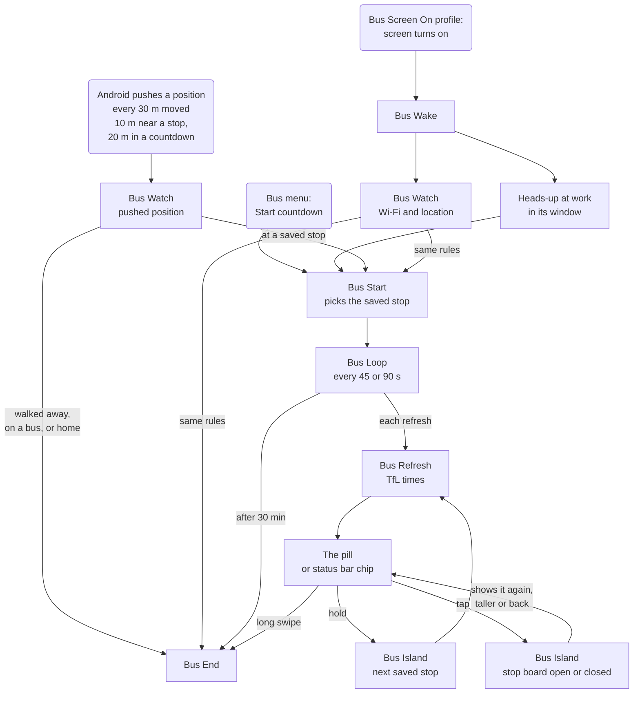
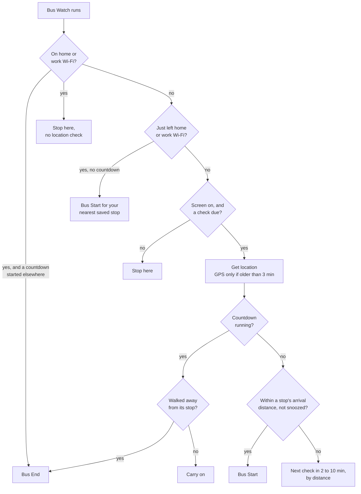
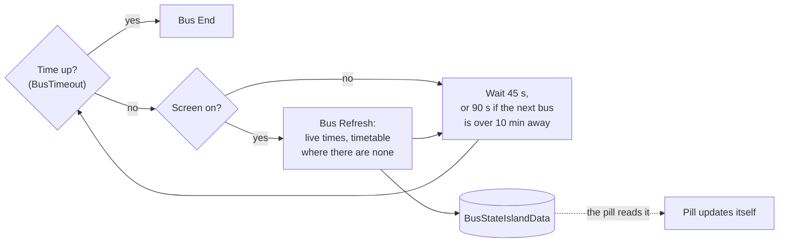
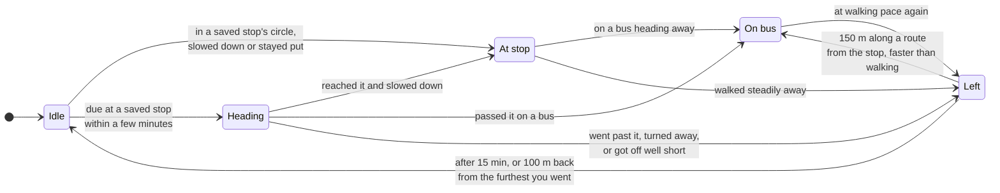
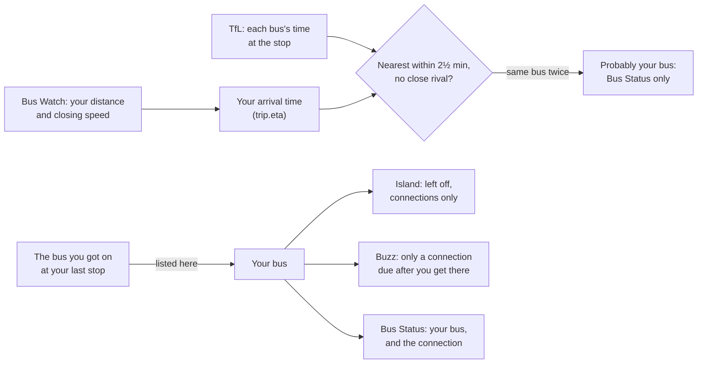

# How it works

Part of the [Bus Countdown](../README.md) documentation.

## The flow at a glance

Android pushes your position to Tasker as you move (every 30 m; every 10 m when you're close to a saved stop; every 20 m during a countdown), and Bus Watch, run by the Bus Moved profile, applies the rules to each one: arriving at a saved stop, or leaving work Wi-Fi (home too, if you choose), starts a countdown; home or work Wi-Fi, walking away or being on the bus ends it. This works with the screen off. Bus Watch applies the same rules when the screen comes on. Turning the screen on at work in the heads-up window, or Start countdown in the Bus menu, also start one. Once running, Bus Loop keeps the times fresh.

More detail: what Bus Watch decides, and what happens on each refresh

### What Bus Watch decides

Bus Watch runs these rules for each position Android pushes (via the Bus Moved profile), using the pushed position; and when the screen comes on (from Bus Wake) and when you run it by hand.

- "Walked away" means more than three times the stop's arrival distance (150 to 250 m) once you've been at the stop, or 200 m further than the closest you got if you haven't reached it yet. Moving at bus speed away from the stop also counts: two positions in a row, or one once you're past the end distance.
- Checks from Bus Wake and Bus Loop don't wait for the next scheduled check.
- "Not snoozed": after you swipe a countdown away (`%BusStateSnooze`), nothing starts again by itself until you've been to that stop and left it (150 m past the closest you came, clear of all your stops), or for 30 minutes.
- Stops by home or work (within 400 m of where Bus Watch has learned they are): on a bus towards one, or within 15 minutes of getting off a bus, it doesn't pop up, since that's where you get off. Walking up to it to catch a bus, it starts as normal; a stop where you change buses always shows.

### Each refresh

- Bus Refresh fetches live arrivals from TfL, fills gaps from today's timetable (fetched after the pill is shown, and only for your routes with no live time, since 4.43), and writes the result to `%BusStateIslandData`. Since 4.41 it also keeps the stop's other routes there (`a`: each one's next three times, up to 8 routes) for the stop board to come. The pill's page picks up the change itself, so it's only shown once per countdown (again if the number of routes changes).
- With the screen off nothing is fetched; Bus Wake fetches fresh times as soon as the screen comes back on.

The pill is a web page inside a Tasker Scene V2 overlay. Bus Refresh builds the page and its layout in a JavaScriptlet, and shows it with Show Scene V2. The page handles route changes, the optional border and the gestures itself, and reads new data from `%BusStateIslandData`, which Bus Refresh updates on each refresh. Tasks it starts (Bus End and Bus Island) receive `%busfrom` = `island`, which is how they know to vibrate.

The pill never flashes when it updates, and never changes size during a countdown. It's sized for every one of your routes at the stop (one dot each, whether or not TfL has a time for it right now) and for two ordinary times ("88 · 88 min", the second smaller); a rarer, wider pair (timetable "~" on both) shows just the first time so it's never cut off. So times changing, a second time appearing or going, a route switching to the timetable, or a route dropping out of the predictions and coming back never change its size; the page just redraws its text. Only switching to a stop with a different number of your routes, or changing Settings, changes the size, and then the new pill is shown on top before the old one is removed: it takes turns between two scene names (`buspill` and `buspill2`, chosen in `island_show.js` by `shared/sceneSwap.js`), so there's never a moment with no pill, even if a refresh is interrupted part-way.

Since 4.43 the page also talks to its own window through the Scene V2 JavaScript bridge, with no Tasker task in between: `moveOverlayBy` moves the whole window with your finger on a swipe, `updateOverlayConfig` grows it into the stop board and tucks it back (its `height`, `configTransitionMs` and `configTransitionEasing`, as Tasker 6.7.6 reads them), `setVariable` sets `busalpha` for the layout's Alpha modifier as a swipe nears the dismissal point, and `dismissLayout` removes it the moment a swipe away is let go. Bus Island is told afterwards (`%busgrow` = `yes` for a board the page grew), only to note it and fetch times that are due.

The overlay window is exactly the size of the pill. Its left edge is calculated from the camera's position so that the gap sits over the camera. The left half fits the stop letter, the widest route badge and `%BusDestLetters` letters of the destination, all measured in the phone's own fonts. The right half is sized to fit the longest likely time plus one dot per route, and the pill is shown again if the number of routes changes. The status bar chip is the same page with the destination left out, placed `%BusChipX` dp from the left.

Camera detection uses Tasker's Java Function action to call `Display.getCutout().getBoundingRects()`, with the current window insets as a second source, and `Resources.getDisplayMetrics()` for the screen density.

Bus Start finds stops from each route's own stop list (`/Line/{id}/StopPoints`) rather than a radius search, because the route list returned by the radius search can include routes that don't stop there. The settings screen uses the radius search only to list stops near you and their routes, and "towards" to tell the two sides of a road apart. The stop across the road is found from the route stop lists (the nearest other stop on the same route within 200 m) and offered, not saved automatically.

## When a countdown ends

A countdown ends when:

- You dismiss it.
- `%BusTimeout` minutes have passed (30 by default).
- Your phone is on your home or work Wi-Fi at a check, unless the countdown started on that same network (so one you start by hand at home or in the office carries on). With the screen off nothing checks, so it ends the moment you turn the screen on.
- You walk away from the stop: more than three times its arrival distance (150 to 250 m, and always at least 100 m beyond the arrival distance itself), once you've been at it; or three positions in a row each further away, once you're past the arrival distance plus 50 m (at least 120 m). A countdown that started before you reached the stop ends once you're 200 m further away than the closest you got.
- You're on the bus: faster than 15 km/h heading away from the stop, on two positions in a row, or on one once you're past the end distance (Android's own speed reading when it has one, otherwise worked out from positions at least 8 seconds apart; a worked-out reading counts as bus speed only if it's still faster than walking after allowing for how accurate the two positions were). Walking towards a stop that a countdown is showing, passing it on a bus takes two fast readings in a row.

During a countdown, Android pushes your position to Tasker each time you've moved 20 m, even with the screen off, and each one is checked against these rules. In testing, walking away was spotted within a minute, with the phone in a pocket. Bus Watch also checks when the screen comes on. If no position arrives for 2 minutes (for example, Bus Moved isn't listening after an import), Bus Loop checks your location itself.

## The trip, step by step

Bus Watch (for every pushed position, and when the screen comes on) keeps each trip in one of five states, in `%BusStateTrip`:

| State | Island | Moves on when |
|---|---|---|
| Idle | none | you're inside a saved stop's circle and have slowed down, or stayed put for 30 seconds whatever a rough GPS speed reading says (at stop), or heading for one due within a few minutes (heading). Heading for one by bus needs a fix good to 50 m: a train standing at a station near the route can give a rough fix that lands on it (4.38) |
| Heading | showing | you reach it and slow down (at stop); you go past it, turn away, or pass it on a bus (left / on bus); or you got off well short of it (walking, more than twice the minutes-ahead setting away, on three checks running and for 2 minutes, not counting standing still: left; if you then keep up bus pace, you were still on the bus: on bus) |
| At stop | showing | you're on a bus heading away, or moving away at over 2.2 m/s for 90 seconds or more, however slowly the bus crawls (on bus); you walk steadily away, or pass the end distance (left: and if the pace then shows it was a bus after all, on bus) |
| On bus | none, unless a saved stop is coming up on the route | you're at walking pace again (left); the stop you boarded at is kept, so a bus held up while still inside its circle doesn't show it again |
| Left | none | after 15 minutes, or once you've come back 100 m from the furthest you went (idle); other stops are free straight away. If you'd got to the stop and are now 150 m or more past it along a route that calls there, faster than walking on average since you left it, you got on a bus there (on bus, and that bus is the one you got on) |

Swiping the island away, the 30-minute limit and getting home also move it to Left. Decisions use the last six positions (`%BusStateWindow`): speed is the median of the last three readings (or the last two both being fast; Android gives a speed for only about one position in eight, so mostly it's worked out from the positions, ignoring any fix worse than 50 m, and holding a reading just under bus speed when the two fixes' error could hide a walk), "moving away" is the trend of your distance over the most recent positions, and fixes worse than 25 m are averaged with the previous one. On a bus, the stop coming up is found by projecting your position onto the route's line of stops, rather than by compass direction. Which way each saved stop's side heads is worked out once and kept in `%BusCacheDir`.

## Which bus you're on

When a countdown shows a stop you're riding a bus towards, Bus Watch keeps when you'd get there at the pace you've been closing in on it, and Bus Refresh compares that with each bus TfL lists. The bus whose time agrees (within 2½ minutes, with no other bus nearly as close) on two refreshes in a row is "probably" yours. On Tuesday 6 October's three rides each bus's time was within 10 to 30 seconds of when you actually reached the stop.

Since 4.34 only a bus you were seen getting on at a stop counts as yours for the island and the buzz. On Wednesday 7 October, coming into Kiln Street on the tram, your arrival time matched the 566 WD21TSS, and 4.33 hid the very bus you were about to catch: a tram or a car closing in on a stop looks exactly like a bus doing so. A "probably" bus stays on the island like any other and nothing buzzes while you ride (as when your bus isn't known); Bus Status and the recording still name it ("probably on the 566 (WD21TSS)"). To keep the bus you got on through a long ride, it's no longer forgotten 15 minutes after a crawl in traffic read as "left" while you're still moving at bus speed (it goes once you've been off bus speed for 5 minutes). And a boarding worked out with the help of a "probably" bus you came in on is saved as not sure either, since that bus may have been wrong.

- Your bus leaves the island while you ride, since you're already on it, and the island shows only the buses you could change to. Bus Status says which bus you're on and when you'll get there. If it's the only bus listed, it stays as an ordinary bus rather than the island saying "No buses". It never buzzes.
- Later buses on your route (the next 517 behind the 517 you're on) keep their place, destination and time, but their route badge is grey, the colour of the island's idle dots, instead of red, so they don't look like yours. Until it's known, nothing buzzes while you ride; once it is, only a connection (a bus due after yours gets there) can. Once your bus has reached the stop and dropped off TfL's list, buzzing is as usual.
- Getting on: when a countdown ends because you're on a bus, or once you're 150 m along a route from a stop you'd got to, faster than walking (as OneBusAway's reminders tell that you've boarded: whatever ended the countdown, only a bus takes you along its route that fast), the bus you got on is the one TfL had arriving nearest the moment you left the stop (including one that dropped off the list in the last 5 minutes, but never the bus you came in on, nor one TfL had dropped while you were still standing at the stop). It's kept for 90 minutes (`%BusStateBoarded`), so at your next stop it's known at once, and recorded with how far TfL's time was from when you left.
- Bus Status shows your bus and the connection ("on the 517, at Wexley in about 2 min; then the 566 6 min after you get there"), and the last bus you got on.

## Sideways

The Bus Hide When Sideways profile (Display Orientation: Landscape) runs the task of the same name when the screen turns sideways and again when it turns back. It asks Android which way up the screen is (its configuration says `port` or `land`) and hides the pill, or shows it with fresh times. Bus Refresh asks the same question before showing the pill. The countdown keeps running while the pill is hidden.

Earlier versions used an invisible overlay to watch for the status bar being hidden, which also hid the pill during picture-in-picture video.

## Battery

- Positions are pushed by Android only as you move (every 30 m; every 10 m only when close to a saved stop; 20 m during a countdown): sitting at home or at your desk costs nothing, and nothing checks on a timer.
- Staying put somewhere 300 m or more outside all your stops' circles (a café, a friend's), indoor GPS wanders 30 to 70 m, which would beat the 30 m step, so positions slow to every 100 m, at most once a minute, until you've moved 150 m; the screen coming on doesn't take a new fix there if there was one in the last 2 minutes.
- During a countdown, Bus Loop doesn't fetch times while the screen is off, except while a bus is within 8 minutes (for the buzz; worked out from when it's due, so it counts down between fetches); Bus Wake fetches them as soon as the screen is back on. While the next bus is more than 10 minutes away it fetches half as often.
- When TfL can't be reached (no signal), each failure in a row doubles the wait before trying again (90, 180, then at most 300 seconds); the first success goes straight back to normal.
- Bus Loop and the screen coming on can both ask for times within seconds of each other (11 times a day on Tuesday and Wednesday). TfL only updates its times about every 30 seconds, so since 4.34 a second fetch for the same stop within 20 seconds is skipped and the island stays as it is (`fetch_due.js`); switching stop, a Settings preview or a run by hand always fetch.
- Every check asks for Android's ordinary location first (Wi-Fi and mobile networks) and only forces GPS on if that position is too old: over a minute during a countdown (so walking away is seen promptly), over 3 minutes otherwise.
- The optional border is updated 4 times a second (several routes) or once a second (one route), with a CSS transition to keep it smooth, and not at all while the screen is off.
- A Tasker profile notices when the phone turns sideways, so nothing runs in the background for it.

## TfL endpoints used

| Endpoint | Used for | Frequency |
|---|---|---|
| `/StopPoint?lat&lon&radius=400` | Stops near you, on the settings screen | Each time Settings opens |
| `/Line/{route}/StopPoints` | All stops on each route | Once a day per route, and when your routes change |
| `/Line/{route}/Route/Sequence/{inbound,outbound}` | The stops in order, both ways, to tell which side of a road heads home or to work | Once a day per route, with the above |
| `/StopPoint/{stop}/Arrivals` | Live arrivals | Every refresh |
| `/Line/{route}/Timetable/{stop}` | Scheduled departures | Once a day per stop and route |

## Known limitations

- While the settings screen is open, the Bus Settings task waits for it to close, and Tasker holds back lower-priority tasks meanwhile (even a task that's only waiting holds back lower ones). So the Bus menu opens Settings at priority 6: above Bus Loop (5), so it opens during a countdown, and below the tasks that handle positions and refreshes (performed at 7 to 11), so those carry on. While Settings is open, the countdown's own loop pauses and picks up again when you close it. The screen closes itself after 10 minutes if it's left open (for example after pressing Home), and opening Settings again replaces a copy that's still waiting.
- Vertical swipes on the pill aren't used, apart from a swipe up to close the stop board: Android intercepts swipes down near the top of the screen, so the board opens with a tap.
- The stop board's corners, and the pill's, are clipped at 20 by Tasker's Scene V2 Clip (a pill's corners can't be rounder than half its height). If Tasker reads that as a percentage rather than dp, the corners come out rounder than the board draws them.
- The Scene V2 bridge drops any error from `updateOverlayConfig`, so the page can't tell whether a resize worked. Viewport units (`vh`) come out as 0 in Tasker's web view, so the page sets its heights in px.
- The timetable fallback uses the standard weekday, Saturday or Sunday timetable. It doesn't know about diversions or engineering works.
- Android sometimes returns an old saved location, especially indoors. Locations more than 3 minutes old are rejected, and GPS is forced on for a second attempt.
- A task started by hand in Tasker runs at top priority and can't wait for a task it calls, so each task only calls another as its last step. Bus Loop, which starts at low priority, is the exception.
